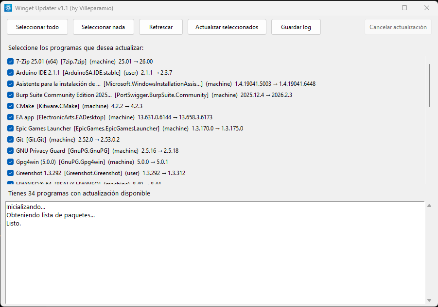

# 🪟 WinGet Updater GUI — Interfaz gráfica para actualizar programas con Winget

**WinGet Updater GUI** es una aplicación escrita en **Python + Tkinter** que ofrece una **interfaz gráfica sencilla** para actualizar software en **Windows 10/11** usando el gestor de paquetes oficial **Winget**.

La aplicación detecta programas con actualizaciones disponibles, permite seleccionarlos desde una GUI, ejecuta las actualizaciones de forma silenciosa y muestra el progreso y el log en tiempo real.

---

## 📦 Descarga
Versión compilada disponible en la sección [Releases](https://github.com/villeparamio/WinGet-updater-GUI/releases).

---

## 🔑 Palabras clave
`winget gui`, `windows updater`, `actualizador de programas`, `python tkinter`, `winget windows`, `package manager windows`

---

## 🚀 Características principales
- Lista automáticamente los programas con actualizaciones disponibles mediante `winget upgrade`.
- Consulta actualizaciones tanto en **scope `user`** como en **scope `machine`**.
- Permite seleccionar qué programas actualizar.
- Ejecuta actualizaciones silenciosas con `winget`.
- Usa coincidencia exacta (`--exact`) para evitar resoluciones ambiguas.
- Muestra progreso y logs en tiempo real.
- Permite cancelar una actualización en curso.
- Guarda el log en un archivo `.txt`.
- Comprueba si `winget` está instalado y, si no lo está, intenta instalar **App Installer** automáticamente.
- Clasifica correctamente distintos resultados de actualización:
  - actualización completada
  - actualización completada pero requiere reiniciar la aplicación
  - paquete no aplicable al sistema
  - paquete no encontrado por `winget`
  - fallo del instalador
- Detecta procesos conocidos en ejecución asociados a ciertos programas.
- Si una actualización falla por **archivos en uso**, puede ofrecer cerrar procesos conocidos y reintentar una vez.
- Usa un fichero separado `process_hints.py` para mantener la lista de procesos asociados a paquetes.

---

## 🧩 Requisitos
- **Windows 10/11**
- **Python 3.12+**
- Módulo `tkinter` (incluido normalmente con Python)
- **Winget** disponible en el sistema, o posibilidad de instalar **App Installer**

---

## ⚙️ Instalación
```bash
git clone https://github.com/villeparamio/WinGet-updater-GUI.git
cd WinGet-updater-GUI
python winget_updater.py
```

---

## 📁 Estructura del proyecto
```text
WinGet-updater-GUI/
├─ winget_updater.py
├─ process_hints.py
├─ winget_updater.ico
├─ winget_updater.png
├─ version.txt
└─ README.md
```

### `process_hints.py`
Este fichero contiene un diccionario con los procesos conocidos asociados a determinados paquetes de Winget.

Se usa para:
- detectar si una aplicación posiblemente está abierta
- ofrecer cerrarla si la instalación falla por archivos en uso
- reintentar la instalación una vez

---

## ▶️ Ejecución
El programa solicita privilegios de administrador al iniciarse, ya que algunas actualizaciones de `winget` requieren elevación.

Al ejecutarlo:

1. Comprueba si `winget` está disponible.
2. Si no lo está, intenta instalarlo automáticamente.
3. Carga la lista de programas con actualización disponible.
4. Permite seleccionar qué paquetes actualizar.
5. Ejecuta cada actualización mostrando el log en tiempo real.
6. Clasifica el resultado final de cada paquete.

---

## 🧠 Comportamiento actual
La aplicación distingue varios escenarios durante la actualización:

- **Updated** → actualizado correctamente.
- **Updated, restart required** → actualizado correctamente, pero la aplicación debe reiniciarse.
- **Not applicable** → Winget indica que la actualización no aplica al sistema o a esa instalación.
- **Not found** → Winget no encuentra un paquete instalado que coincida con el ID.
- **Installer failed** → error real del instalador.
- **Cancelled** → cancelado por el usuario.

Además, si se detecta un fallo típico de **"files in use"** y existen procesos conocidos asociados al paquete, la aplicación puede preguntar al usuario si quiere cerrarlos y reintentar la actualización una vez.

---

## 📜 Changelog

### v1.1
- Se mejora la clasificación de resultados de `winget`.
- Se diferencia entre:
  - actualización completada
  - actualización completada con reinicio de aplicación pendiente
  - paquete no aplicable
  - paquete no encontrado
  - fallo del instalador
  - cancelación por usuario
- Se usa `--exact` en las operaciones de actualización para evitar coincidencias ambiguas.
- Se añade precheck antes de actualizar cada paquete.
- Se añade soporte para detección de procesos conocidos asociados a paquetes.
- Se añade la posibilidad de cerrar procesos conocidos y reintentar una actualización fallida por archivos en uso.
- Se separa la configuración de procesos asociados en el fichero `process_hints.py`.

### v1.0
- Primera versión pública de la interfaz gráfica para actualizar programas con `winget`.
- Listado de software con actualizaciones disponibles.
- Selección manual de paquetes.
- Ejecución de actualizaciones desde GUI.
- Visualización de logs en tiempo real.
- Guardado de log en fichero de texto.
- Instalación automática de `winget` si no está presente.

---

## 💻 Compilación en `.exe` (opcional)
```bash
pyinstaller --clean --onefile --noconsole --uac-admin ^
  --icon winget_updater.ico ^
  --version-file version.txt ^
  --add-data "winget_updater.ico;." ^
  --add-data "winget_updater.png;." ^
  winget_updater.py
```

---

## 🧠 Captura de pantalla


---

## ⚠️ Limitaciones conocidas
- La salida de `winget` no siempre es totalmente consistente entre paquetes.
- Algunos paquetes pueden aparecer como actualizables pero luego resultar **no aplicables** o **no encontrables** al intentar actualizarlos.
- Algunos fallos del instalador dependen del propio paquete, del estado interno de Windows o de reinicios pendientes.
- La detección de procesos abiertos se basa en heurísticas definidas manualmente en `process_hints.py`, no en inspección completa de handles del sistema.

---

## 🔗 Más información
- [Documentación de Winget](https://learn.microsoft.com/es-es/windows/package-manager/)
- [PyInstaller](https://pyinstaller.org/)
- [Tkinter Docs](https://docs.python.org/3/library/tkinter.html)

---

## 🪪 Licencia
MIT License © [villeparamio](https://github.com/villeparamio)

---

## 💖 Donaciones

Si encuentras este proyecto útil y quieres apoyar su desarrollo y mantenimiento, considera hacer una donación.  
Tu contribución ayuda a seguir mejorando y manteniendo este software libre.

### 💸 PayPal
Puedes donar fácilmente mediante PayPal haciendo clic en el siguiente botón:

[](https://www.paypal.com/donate/?business=95M7L3UZENS6Q&no_recurring=0&currency_code=EUR)

Gracias por tu apoyo 🙏